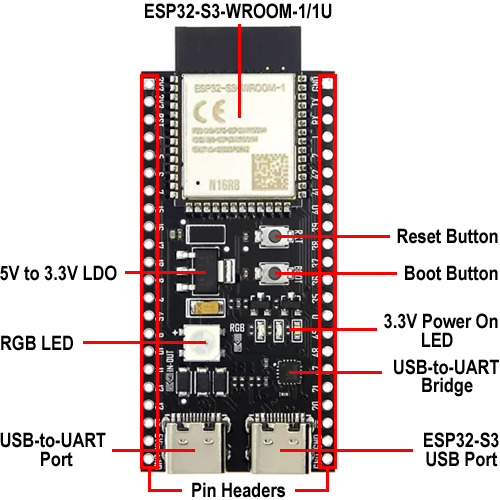
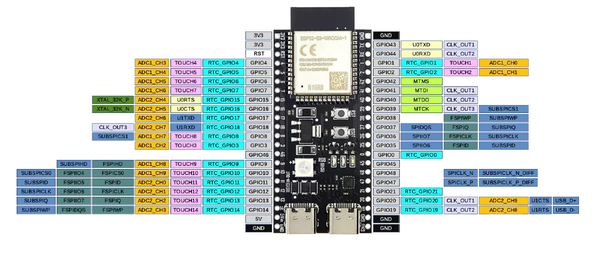

# Pinout & Wiring

## Board

ESP32-S3-N16R8 dev board (generic "YD" / Microrobotics reference design).

- 16MB flash, 8MB PSRAM
- **Two USB-C ports**:
  - Left: USB-to-UART bridge (CH343P) — traditional serial, auto-reset for flashing.
  - Right: ESP32-S3 native USB — CDC serial straight from the chip; also used by native-USB flashing.
- All GPIOs are **3.3V**. Never connect 5V to a GPIO.

## Onboard features worth knowing about

| Feature | Pin / Notes |
|---|---|
| **3.3V power LED** | Red. Always on when powered. Not controllable. |
| **RGB LED (WS2812B)** | GPIO 48. Addressable (not on/off). **Requires bridging the "RGB" solder jumper on the board** before GPIO 48 drives it — check underside/topside near the LED. Once bridged, GPIO 48 is dedicated. |
| **TX LED** | GPIO 43. Blinks with UART TX activity. Usable as GPIO if USB-UART serial not needed. |
| **RX LED** | GPIO 44. Blinks with UART RX activity. Same caveat. |
| **BOOT button** | GPIO 0. Active low. Internal pull-up. RTC-capable (deep sleep wakeup). |
| **RESET button** | Hardware reset; not a GPIO. |

## Planned pin assignments

| GPIO | Role | Notes |
|---|---|---|
| 48 | Onboard RGB LED (WS2812B) | Step 2 — cheapest + coolest blink target. Requires the "RGB" solder jumper to be bridged. |
| 4 | DS18B20 data (1-Wire) | Open-drain. Needs 4.7kΩ pull-up to 3.3V (external, or built into the DFRobot adapter). |
| 5 | Spare — was the external-LED pin in the original plan; redundant given the RGB LED. Free for future use. | — |
| 0 | Button | BOOT button. Already wired — no external wiring needed for Step 7 if you're happy reusing BOOT as the user button. |
| 3V3 | Sensor / pull-up power | — |
| 5V | Power input | From USB or MH-CD42 boost output. |
| GND | Common ground | — |

## Stage-by-stage wiring

### Step 1 — Hello world
No wiring. USB-C cable only. Use the **right** USB port (native USB) for the default `cargo run` flash.

### Step 2 — Blink
Two options:

- **Preferred:** No wiring. Bridge the "RGB" solder pad if not already, then drive GPIO 48 as a WS2812 via the `ws2812-esp-hal-driver` or `smart-leds` / `esp-idf-hal`'s RMT peripheral.
- **Fallback (if you don't want to solder):** GPIO 5 → 330Ω → LED anode → LED cathode → GND.

### Step 3 — DS18B20 with DFRobot adapter
- Adapter VCC → 3V3
- Adapter GND → GND
- Adapter signal → GPIO 4
- Probe into adapter screw terminals: red=VCC, yellow=DATA, black=GND

### Step 4 — DS18B20 bare probe
- Probe red → 3V3
- Probe black → GND
- Probe yellow → GPIO 4
- **4.7kΩ** resistor between 3V3 and GPIO 4 (the pull-up the adapter was providing)

### Step 7 — Button
Either:
- Reuse the onboard **BOOT** button (GPIO 0). Nothing to wire.
- Or add a tactile button: one side → GPIO 0, other side → GND. Internal pull-up in software.

### Step 9 — Battery
- 18650 cell in holder: + → MH-CD42 BAT+, − → MH-CD42 BAT−
- MH-CD42 OUT+ → ESP32 5V
- MH-CD42 OUT− → ESP32 GND
- USB-C on MH-CD42 is charging input (not the ESP32's USB-C).

## BOOT / RST recovery

If `espflash` can't detect the chip:
1. Hold **BOOT** (GPIO 0).
2. Press **RST**.
3. Release **BOOT**.

Board is now in download mode. Try flashing again.
