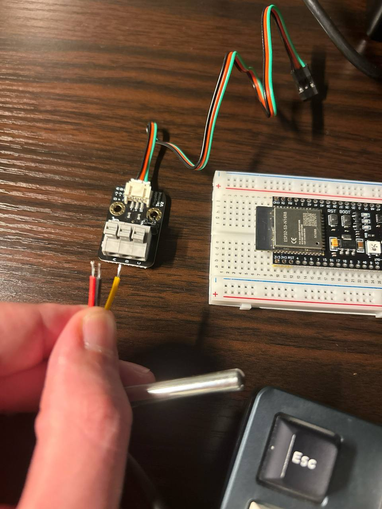
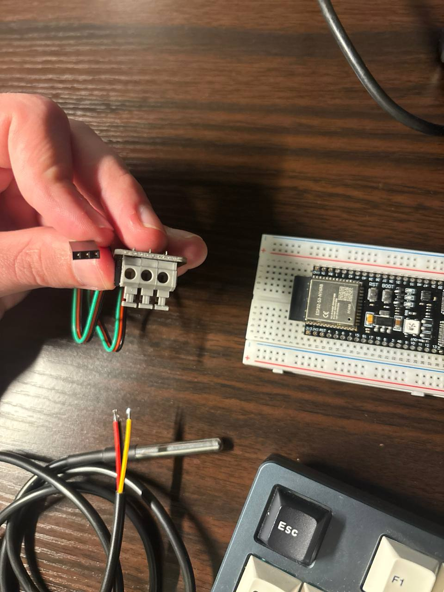

# Step 3 — Read the DS18B20 (DFRobot kit adapter)

**Status:** ✅ done (2026-04-18)
**Goal:** Read a temperature value from the DS18B20 waterproof probe via the DFR0198 terminal-block adapter, log it once every 2 seconds over the serial console.

## Why this before Step 2

Step 2 (blinking the onboard RGB LED) needs the "RGB" solder jumper on the board bridged, and we don't have a soldering iron yet. All the hardware for Step 3 is already on the desk, so we reorder. We'll come back to Step 2 when we have either an iron or an external LED.

## Hardware setup

DFR0198 kit = the DS18B20 waterproof probe + a "Pluggable Terminal V2" adapter board that already has the 4.7 kΩ pull-up baked in. This means **no external resistor needed** for this step — that's what the bare-probe version (Step 4) will teach.

Photos of the parts before wiring:




### Wire colours

Both cables follow standard conventions (black = GND, red = VCC), but the signal wire colour differs — yellow on the probe, green on the JST cable. Trust the silkscreen labels on the adapter (`D`, `+`, `−`), not the wire colour.

| Cable | Red | Yellow | Black | Green |
|---|---|---|---|---|
| DS18B20 probe | VCC | DATA | GND | — |
| DFR0198 JST cable | VCC | — | GND | DATA |

### Probe → adapter screw terminals

Adapter is silkscreened with `A / B / C` on the terminal block and `D / + / −` as function labels directly on each terminal.

| Probe wire | Screw terminal | Function |
|---|---|---|
| Yellow | A (`D`) | DATA |
| Red    | B (`+`) | VCC |
| Black  | C (`−`) | GND |

### Adapter JST cable → ESP32-S3

Using M-M jumpers through the breadboard rows adjacent to the dev board:

| JST cable wire | ESP32 pin | Function |
|---|---|---|
| Green | GPIO 4 | DATA |
| Red   | 3V3    | VCC |
| Black | GND    | GND |

## Concepts introduced

### 1-Wire protocol (new concept — probably worth a file in `docs/concepts/`)

- Single data wire plus ground. Master (ESP32) initiates all communication; slaves speak only when addressed.
- Bus idles HIGH via pull-up resistor. Master (or slave) signals by briefly pulling LOW, then releasing.
- Every device is always **open-drain** — it can pull LOW, or release to let the pull-up pull HIGH. It cannot drive HIGH. This is why contention doesn't cause shorts.
- Addressing: each DS18B20 has a unique 64-bit ROM ID. With one device on the bus you can `SKIP ROM` (0xCC) and skip addressing.
- Temperature read = two transactions:
  1. `CONVERT T` (0x44) — tell the sensor to convert. Wait ~750 ms for 12-bit resolution.
  2. `READ SCRATCHPAD` (0xBE) — read 9 bytes; the first two are the signed 16-bit temperature in 1/16 °C.

### Open-drain GPIO in `esp-idf-hal`

- Plain push-pull output (`PinDriver::output`) drives the pin HIGH or LOW actively — no good for 1-Wire.
- Open-drain (`PinDriver::input_output_od`) can pull LOW or release (high-Z). With the pull-up on the bus, releasing means the pull-up takes over and the line floats HIGH.
- Signature gotcha from `initial_plan.md`: **must** use `input_output_od`, not `output`.

## Crate choices

Two community crates on top of `esp-idf-hal`:

```toml
one-wire-bus = "0.1"   # protocol layer: reset pulses, timing slots, CRC, ROM commands
ds18b20      = "0.1"   # device layer on top: start_conversion, read temperature
```

Both crates are **v0.1.1** — `initial_plan.md` said 0.2 but that version was never released. They target **`embedded-hal 0.2`** (legacy trait version), while `esp-idf-hal 0.46+` is primarily built around `embedded-hal 1.0`. The 0.2 compat for `PinDriver` comes along for the ride via `esp-idf-hal`'s default features — if trait-bound errors pop up, we enable the compat feature explicitly.

Key timing gotcha: 1-Wire bit slots are 1–60 µs wide, so we use **`Ets`** (microsecond delay) for the protocol, and **`FreeRtos::delay_ms`** only for the outer "wait for the 750 ms conversion to finish" and the 2 s loop gap — `FreeRtos` rounds up to whole ticks (1 ms) and would wreck bit-banging.

## Implementation plan

1. Wire the adapter (above).
2. Add deps to `Cargo.toml`.
3. Rewrite `main.rs`:
   - Take peripherals, grab `gpio4`, create `PinDriver::input_output_od`.
   - Build a `OneWire` bus on that pin.
   - Search for devices — log the 64-bit address(es) found. Proof of life.
   - Call `start_simultaneous_temperature_measurement`, `delay_ms(750)`, read each device's scratchpad.
   - Log `"temp: 23.4 °C"`.
   - `FreeRtos::delay_ms(2000)`, repeat.
4. Flash with `cargo run --release`, confirm output.
5. Touch the probe to warm/cold things, confirm value tracks.

## Code

See [`temp_monitor/src/main.rs`](../../temp_monitor/src/main.rs) for the final version. High-level structure:

```rust
fn read_all<P, E>(bus: &mut OneWire<P>, delay: &mut Ets) -> OneWireResult<usize, E>
where
    P: OutputPin<Error = E> + InputPin<Error = E>,
    E: core::fmt::Debug,
{
    ds18b20::start_simultaneous_temp_measurement(bus, delay)?;  // 0xCC SKIP ROM + 0x44 CONVERT T
    Resolution::Bits12.delay_for_measurement_time(delay);       // wait ~750 ms

    let mut search_state = None;
    let mut count = 0;
    loop {
        match bus.device_search(search_state.as_ref(), false, delay)? {
            Some((address, state)) => {
                search_state = Some(state);
                if address.family_code() != ds18b20::FAMILY_CODE { continue; }
                let sensor = Ds18b20::new(address)?;
                let data = sensor.read_data(bus, delay)?;
                info!("{:?}  {:6.2} °C  (res {:?})", address, data.temperature, data.resolution);
                count += 1;
            }
            None => break,
        }
    }
    Ok(count)
}
```

`main` just takes peripherals, builds the `PinDriver::input_output_od(gpio4, Pull::Up)`, wraps it in `OneWire`, and loops: `read_all` + 2 s `FreeRtos::delay_ms`.

## What I learned

### Rust / ecosystem lessons

- **`embedded-hal 0.2` vs `1.0` split is real.** `one-wire-bus` and `ds18b20` both target the legacy 0.2 trait API; `esp-idf-hal 0.46+` targets 1.0 but ships 0.2 compat via default features. Both can coexist in one project.
- **Transitive deps aren't visible.** I had to add `embedded-hal = "0.2"` as a direct dep because `use embedded_hal::digital::v2::{InputPin, OutputPin}` is only resolvable from direct deps in Rust 2018+.
- **Phantom type inference** — `Ds18b20::new::<E>(address)` takes a generic `E` used only in the return type. At a bare call site the compiler can't infer `E`, so you either turbofish a concrete type or — the idiomatic fix — **move the logic into a helper function** whose generic bounds tie `E` to the pin's error type. That's why `read_all` is a separate generic fn rather than inlined in `main`.
- **`Ds18b20::new(address).unwrap()` inside a `Result<_, OneWireError<_>>` context "just works"** because `?` propagates `OneWireError<E>` and the `E` is already bound.

### Embedded / hardware lessons

- **Open-drain is non-negotiable for 1-Wire.** See [concepts/one-wire-protocol.md](../concepts/one-wire-protocol.md). `PinDriver::input_output_od` with `Pull::Up` gave us a working bus. Push-pull would have short-circuited the pull-up.
- **Microsecond delays require `Ets`, not `FreeRtos`.** FreeRTOS delays are tick-based (1 ms granularity) and would have smashed the 60–120 µs bit slots. `Ets` uses the ESP-IDF microsecond timer.
- **Reverse polarity can cook a DS18B20 in seconds.** Check probe temperature before trusting that "the wiring looks right." A warm probe = disconnect now.
- **Intermittent screw-terminal contacts are the #1 breadboard bug.** Stripped conductor too short, or not clamped tight enough, and the wire "is connected" from a visual inspection but actually isn't. The `bus.reset()` diagnostic that returned mostly `no presence` but occasionally `presence detected ✓` during cable wiggling was the smoking gun. See gotcha.
- **Probe output cross-verifies everything.**
  - ROM `8A00001125DC9D28` — `28` family code confirms DS18B20.
  - 12-bit resolution default, ~0.0625 °C precision.
  - Peaked at 32.19 °C in-hand, cooled back to ~28 °C over ~30 s — smooth thermal response, no dropped reads.

### Debugging journey (for future-me)

1. **Stale API in plan** — `PinDriver::input_output_od` added a `Pull` argument post–plan-authorship. Caught by compiler.
2. **Unused `Resolution` import** — was a leftover from a `FreeRtos::delay_ms(800)` substitution; putting it back (for the library-native `delay_for_measurement_time`) resolved it.
3. **`Ds18b20::new` type inference** — fixed via the generic helper function.
4. **Initial wire-colour mismapping** — misread the JST cable convention on the first glance. Caused "no devices found", then after swap, `BusNotHigh`. Resolved by re-reading the silkscreen carefully.
5. **Intermittent screw-terminal contact** — diagnosed by logging `bus.reset()` explicitly and wiggling the wires. Firm re-seating fixed it permanently.

## Next step

[Step 4 — Read the DS18B20 (bare probe + manual pull-up)](04-ds18b20-bare.md) (not yet written). Same code, different wiring: bare probe direct to ESP32 + external 4.7 kΩ between DATA and 3V3 — reveals that the DFR0198 adapter was "just" a pull-up resistor + terminal block.
